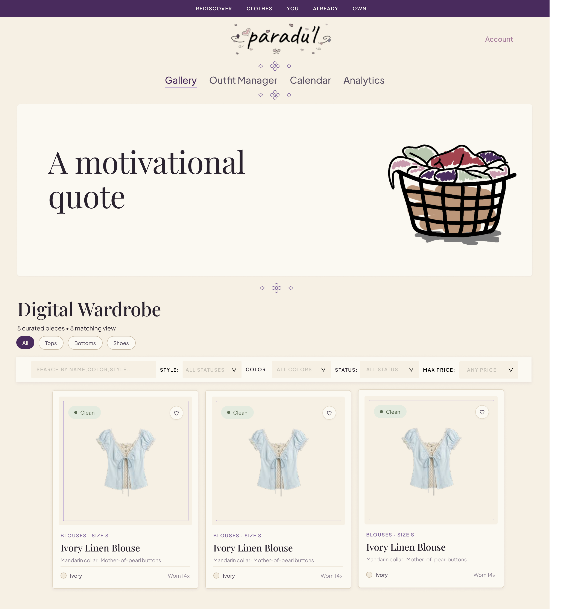

# paradu'l — Digital Wardrobe & Mindful Styling

[](https://github.com/Jeniii26/Paradul-Tongol)
[](https://paradul.vercel.app/)
[](https://jeniii26.github.io/Paradul/)
[](AI-USAGE.md)

*Built with AI assistance using ChatGPT, Claude, and Google Antigravity (Gemini). See [AI-USAGE.md](AI-USAGE.md) for full prompt logs, failure analysis, and self-authored code breakdown.*

---

### 🌐 Quick Links & Live Deployments
* **Live App on Vercel:** [https://paradul.vercel.app/](https://paradul.vercel.app/)
* **Live App on GitHub Pages:** [https://jeniii26.github.io/Paradul/](https://jeniii26.github.io/Paradul/)
* **Demo Video Recording:** [Watch the Video Recording](https://drive.google.com/drive/folders/1KLe95kHFs4N8nk9EJBeRkLDtNpXZLj50?usp=sharing)
* **Design System Specification:** [docs/03-design-system.md](docs/03-design-system.md)
* **Wireframes & Mockups:** [docs/02-mockup.md](docs/02-mockup.md)

---

## 1. Application Screenshot



---

## 2. Overview & Problem Statement

**paradu'l** is a digital wardrobe and mindful style management web application created to help users digitally organize their wardrobe, mix and match outfits, and use personalized data insights to make smarter fashion choices.

It aims to address impulsive shopping and wardrobe underutilization by providing users with a visual inventory of clothing items they already own, allowing them to better understand and manage their personal style.

### Key Features at a Glance:
1. **Digital Wardrobe Gallery:** Visual inventory with checkered transparency backdrops, dynamic session quote banner, multi-criteria filtering (Status, Color, Style, Max Price ₱, Search), and real photo upload with client-side HTML5 Canvas background removal and metadata editing.
2. **Outfit Manager:** Strict 3-piece coordinated ensembles (1 Top, 1 Bottom, 1 Shoes) with real-time visual stack preview and an intelligent look randomizer that strictly excludes items currently in laundry.
3. **Calendar & Automated 7-Day Laundry:** Interactive calendar planner with `[ Mark as Worn ]` confirmation that automatically schedules Tops and Bottoms for a 7-day laundry period while keeping Shoes clean.
4. **Wardrobe Analytics & Style Insights:** Real-time data calculations for Top 3 Most Used Clothing pieces (with `#1`, `#2`, `#3` podium badges), Most Used Outfit, Most Used Color, Total Wardrobe Value in Philippine Pesos (`₱`) without double-counting, Laundry & Availability gauge, Category Distribution bars, and Recent Wear Logs.

---

## 3. Cloud Backend-as-a-Service (Supabase BaaS)

Rather than maintaining a standalone local server, **paradu'l utilizes Supabase as its production Backend-as-a-Service (BaaS)**:

* **PostgreSQL Database:** Hosts relational tables for `clothing_items`, `outfits`, `schedules`, and `wear_records` (schema documented in [`server/db/supabase-schema.sql`](server/db/supabase-schema.sql)).
* **Row-Level Security (RLS):** Strict security policies ensure users can only view, create, edit, and delete their own wardrobe items (`auth.uid() = user_id`).
* **Supabase Authentication:** Secure JWT-based user session persistence, password hashing, and authentication state listeners.
* **Resilient Dual Data Layer:** Built with a unified API gateway ([`client/src/api/index.js`](client/src/api/index.js)). When online with Supabase keys configured, it communicates directly with the Supabase PostgreSQL database; when offline, it gracefully falls back to browser `localStorage` (`mockApi.js`) so the application never breaks.

---

## 4. Setup and Local Installation

### Prerequisites
* [Node.js](https://nodejs.org/) (v20+ recommended)
* Git

### Clone the Repository
```bash
git clone https://github.com/Jeniii26/Paradul-Tongol.git
cd Paradul-Tongol
```

### Install Dependencies
```bash
cd client
npm install
```

### Environment Configuration
Copy the template environment file:
```bash
cp .env.example .env
```
To connect to your live Supabase database, provide your Supabase URL and anonymous key:
```env
VITE_USE_MOCK_API=false
VITE_SUPABASE_URL=https://your-project.supabase.co
VITE_SUPABASE_ANON_KEY=your-supabase-anon-key
```
*(If unset or left in demo mode, the app automatically runs against the local mock API with pre-loaded sample wardrobe items).*

### Start Local Development Server
```bash
npm run dev
```
Open [http://localhost:5173](http://localhost:5173) in your browser.

### Run Automated Verification Test Suite
```bash
npm test
```
Runs 14 automated tests verifying laundry business logic, date calculations, and analytics algorithms.

### Build for Production
```bash
npm run build
```

---

## 5. Project Directory Structure

```text
Paradul-Tongol/
├── .github/
│   └── workflows/
│       └── deploy.yml              # Automated GitHub Actions workflow for GitHub Pages
├── assets/
│   └── screenshot.png             # Application preview screenshot
├── client/
│   ├── public/
│   │   ├── banner.png             # Hero quote laundry basket artwork
│   │   └── logo.png               # paradu'l brand logo
│   ├── src/
│   │   ├── api/
│   │   │   ├── index.js           # Unified API gateway (Supabase vs Mock API)
│   │   │   ├── supabaseApi.js     # Supabase PostgreSQL client integration
│   │   │   ├── supabaseClient.js  # Supabase client initialization
│   │   │   ├── mockApi.js         # Browser localStorage fallback persistence
│   │   │   ├── sampleData.js      # Seed wardrobe items and SVG illustrations
│   │   │   └── httpApi.js         # REST HTTP client interface
│   │   ├── components/
│   │   │   ├── common/            # Icons (fashion SVGs) and generic Modal
│   │   │   ├── Gallery/           # GalleryView, ClothingCard, UploadModal, EditClothingModal
│   │   │   ├── OutfitManager/     # OutfitManagerView, OutfitCard, OutfitCreatorModal
│   │   │   ├── Calendar/          # CalendarView, ScheduleModal
│   │   │   ├── Analytics/         # AnalyticsView
│   │   │   ├── Header.jsx         # Plum top banner, logo, flourish dividers, nav tabs
│   │   │   └── Login.jsx          # User login and sign-up interface
│   │   ├── services/
│   │   │   ├── authService.js     # Supabase auth & mock session management
│   │   │   ├── laundryService.js  # 7-day laundry transition & expiration engine
│   │   │   ├── analyticsService.js# Wardrobe value, top clothing & outfit metrics
│   │   │   └── imageProcessingService.js # HTML5 Canvas background removal & detection
│   │   ├── App.jsx                # Main application state orchestration
│   │   ├── main.jsx               # React entry point
│   │   └── styles.css             # Design system tokens, warm porcelain theme, & responsive styles
│   ├── test-services.js           # Automated verification test suite (14 tests)
│   ├── index.html                 # Application HTML shell
│   ├── package.json               # Client scripts and dependencies
│   ├── vercel.json                # Vercel SPA client rewrite configuration
│   └── vite.config.js             # Vite configuration with relative base path support
├── server/
│   └── db/
│       └── supabase-schema.sql    # PostgreSQL schema for Supabase tables & RLS policies
├── docs/
│   ├── 01-proposal.md             # Project proposal and requirements
│   ├── 02-mockup.md               # Wireframe evolution, PDF links, and screen mockups
│   ├── 03-design-system.md        # Color system, typography, and UI specifications
│   ├── 04-weekly-reports.md       # Development progress logs across all weeks
│   ├── 05-demo-video.md           # Video recording presentation guide
│   └── 06-security-and-privacy.md # Security checklist and data privacy reflection
├── AI-USAGE.md                    # Complete AI prompt disclosure and self-authored code breakdown
└── README.md                      # Main project documentation
```

---

## 6. Project Completion Status

### ✅ All Project Deliverables Completed:
* [x] **Figma Wireframe UI Redesign:** Full visual alignment with the Figma design specification (`wireframes.pdf`), including the warm porcelain canvas, deep ink/plum typography, Cormorant Garamond serif headings, ornamental flourish dividers, and editorial hero quote banner.
* [x] **Supabase BaaS Integration:** Relational database storage in PostgreSQL with user authentication and Row-Level Security.
* [x] **Digital Wardrobe Gallery:** Multi-parameter combinable filtering, search, and dynamic session quote cycling.
* [x] **Canvas Background Removal:** Client-side transparent PNG generation and photo downscaling.
* [x] **Clothing Metadata Editing:** In-place metadata editing modal for existing pieces.
* [x] **3-Piece Outfit Manager:** Coordinated look builder and laundry-safe look randomizer.
* [x] **Calendar & 7-Day Laundry Automation:** Automated laundry scheduling for Tops and Bottoms upon wear with automatic expiration.
* [x] **Wardrobe Analytics:** Top 3 podium with rank badges, wardrobe valuation in ₱, laundry availability bar, category distribution progress bars, and recent wear logs table.
* [x] **Dual Deployment:** Live and operational on both **Vercel** ([https://paradul.vercel.app/](https://paradul.vercel.app/)) and **GitHub Pages** ([https://jeniii26.github.io/Paradul/](https://jeniii26.github.io/Paradul/)).
* [x] **Automated Testing:** 14/14 tests passing (`npm test`).

---

## 7. AI Usage Disclosure

[](AI-USAGE.md)

This project was built with AI assistance (ChatGPT, Claude, and Google Antigravity / Gemini) adhering to academic guidelines. See [AI-USAGE.md](AI-USAGE.md) for the full log of prompts, problem resolutions, and the breakdown of self-authored code.
