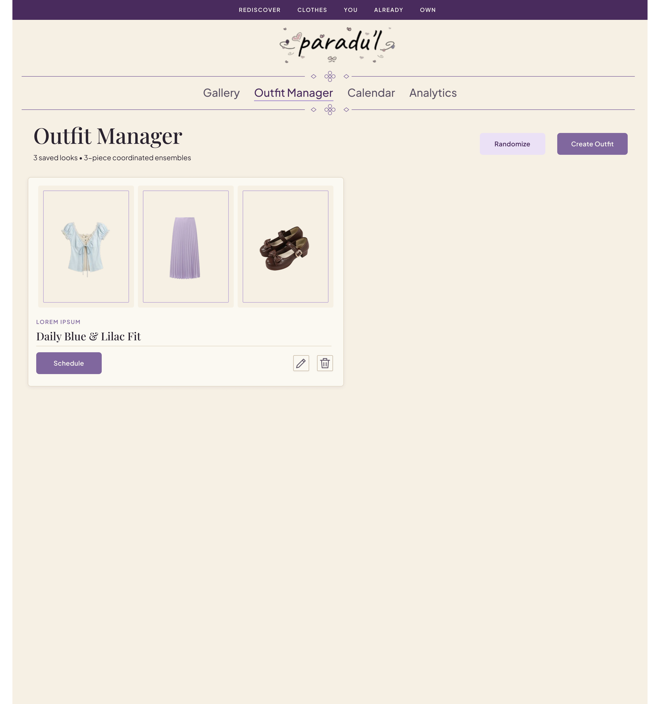
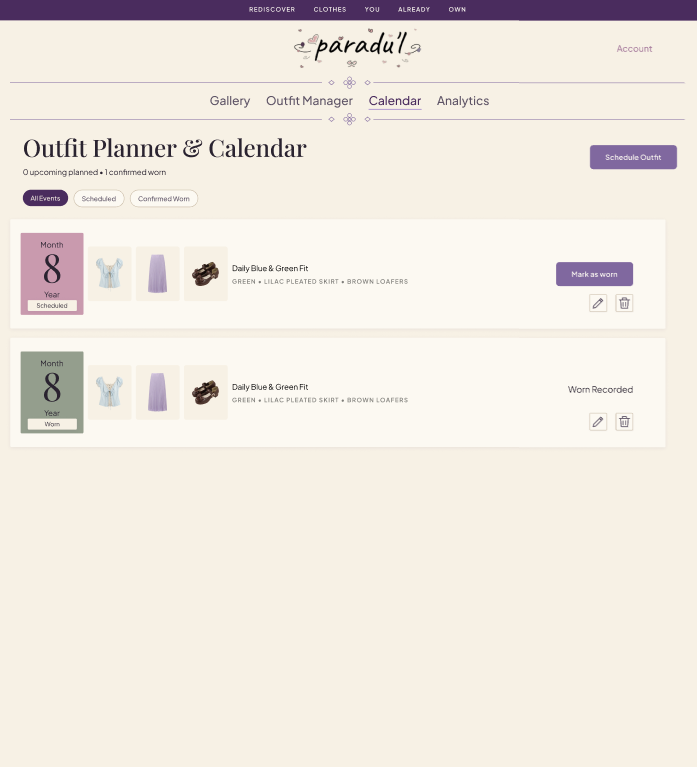
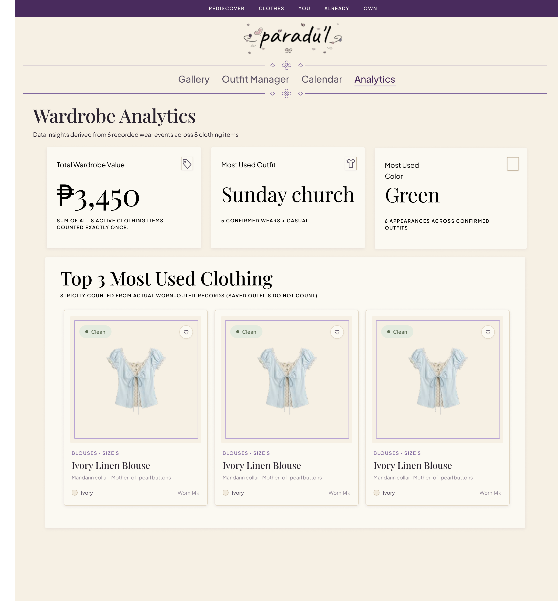

# paradu'l — Wireframes & UI Mockups

## 1. Wireframe Evolution & Source Files

During the design and prototyping phase, two iterations of wireframes were produced:

1. **`Initial wireframes.pdf`:**  
   The initial preliminary wireframe draft outlining early layout ideas, initial card structures, and feature placement.
2. **`wireframes.pdf`:**  
   The **final, refined wireframe specification** developed in Figma ([Figma Design Board](https://www.figma.com/design/NussYjveoq70JXoTlPA3Vc/Apsi-2?node-id=20-36)). This is the authoritative wireframe specification followed for the final application UI.

> **Note on Iteration:**  
> The wireframes were edited and enhanced from the initial draft to incorporate:
> - The top edge-to-edge plum banner (`REDISCOVER CLOTHES YOU ALREADY OWN`) and centered logo with decorative flourish dividers (`◇ ꕤ ◇`).
> - Hero motivational quote banner with laundry basket artwork.
> - Micro-category metadata styling (`BLOUSES · SIZE S`), Cormorant Garamond serif headings, and color dot chips.
> - Refined 3-piece horizontal outfit cards (Top, Bottom, Shoes).
> - Distinctive mauve and sage calendar date badges with outfit piece mini-thumbnails.
> - Wardrobe analytics podium with #1, #2, #3 rank badges and wear log tables.

---

## 2. Final Wireframe Screens & Mockups

Below are the 4 core wireframe screens extracted from `wireframes.pdf` that were implemented in the application:

### Screen 1: Digital Wardrobe Gallery
The main inventory view where users browse, search, filter, and upload clothing pieces.

* **Key Elements:** Hero motivational quote banner, flourish divider, category filter pills (All, Tops, Bottoms, Shoes), secondary filter toolbar (Status, Color, Style, Max Price ₱, Search), and clothing cards with clean/laundry status badges and metadata.

---

### Screen 2: Outfit Manager
The 3-piece ensemble coordinator and clean-only look randomizer.

* **Key Elements:** Heading with "Randomize" and "Create Outfit" action buttons, 3-frame piece row per card (Top, Bottom, Shoes), wear count badge, and schedule/edit/delete controls.

---

### Screen 3: Calendar & Outfit Planner
The chronological look planner and wear confirmation center.

* **Key Elements:** Category filter pills (All Events, Scheduled, Confirmed Worn), rectangular Mauve/Sage date badges, trio of piece thumbnails, uppercase piece summary, and the `[ Mark as Worn ]` trigger.

---

### Screen 4: Wardrobe Analytics & Style Insights
Data-driven insights derived strictly from confirmed wear events.

* **Key Elements:** 3 KPI summary cards (Total Wardrobe Value in ₱, Most Used Outfit, Most Used Color), Laundry & Availability readiness bar, Category Distribution progress bars, Top 3 Most Used Clothing podium with rank badges (#1, #2, #3), and Recent Wear Logs chronological history.

---

## 3. Responsive Adaptations

The application layout was built with CSS media queries at `1200px`, `1024px`, `900px`, `768px`, and `480px` to guarantee seamless viewing across all device form factors:
- **Desktop (1200px+):** Full 3-column clothing grids, side-by-side analytics sections, and horizontal calendar cards.
- **Tablet (768px – 1024px):** 2-column grids, auto-wrapping filter toolbars, and stacked analytics cards.
- **Mobile (320px – 768px):** Single-column cards, horizontally scrollable category pills, compact date badges, and full-width touch-friendly actions.
